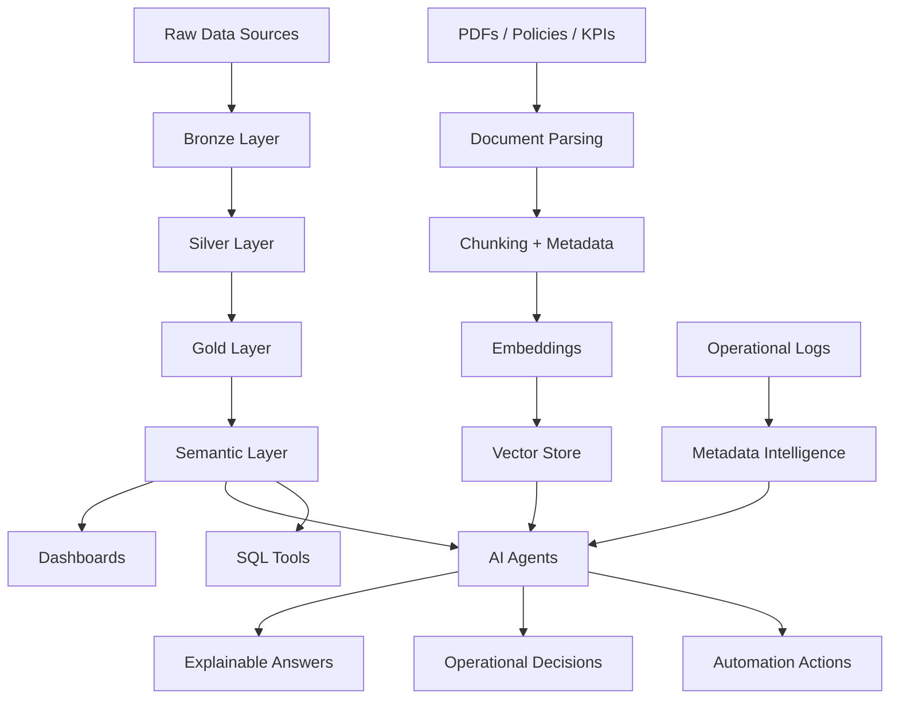

<!--
╔══════════════════════════════════════════════════════════════════════════════╗
║                                                                              ║
║   ██████╗ ███╗   ███╗ █████╗ ██████╗     ██╗   ██╗ █████╗ ██╗     ██████╗  ║
║  ██╔═══██╗████╗ ████║██╔══██╗██╔══██╗    ██║   ██║██╔══██╗██║     ██╔══██╗ ║
║  ██║   ██║██╔████╔██║███████║██████╔╝    ██║   ██║███████║██║     ██║  ██║ ║
║  ██║   ██║██║╚██╔╝██║██╔══██║██╔══██╗    ╚██╗ ██╔╝██╔══██║██║     ██║  ██║ ║
║  ╚██████╔╝██║ ╚═╝ ██║██║  ██║██║  ██║     ╚████╔╝ ██║  ██║███████╗██████╔╝ ║
║   ╚═════╝ ╚═╝     ╚═╝╚═╝  ╚═╝╚═╝  ╚═╝      ╚═══╝  ╚═╝  ╚═╝╚══════╝╚═════╝  ║
║                                                                              ║
║                 DATA ARCHITECT · LAKEHOUSE · AI AGENTS                       ║
║                                                                              ║
╚══════════════════════════════════════════════════════════════════════════════╝
-->

<div align="center">


<br/>
<br/>


</div>

---

<div align="center">

```txt
┌─────────────────────────────────────────────────────────────────────────────┐
│                                                                             │
│   SYSTEM BOOT: OMAR_VALDEZ_PROFILE                                          │
│   STATUS     : ONLINE                                                       │
│   ROLE       : DATA ARCHITECT / AI AGENTS ENGINEER / AUTOMATION BUILDER      │
│   MISSION    : TURN DATA CHAOS INTO OPERATIONAL INTELLIGENCE                 │
│                                                                             │
└─────────────────────────────────────────────────────────────────────────────┘
```

</div>

## 🧬 Core Identity

I design and build **modern data platforms, AI-powered agents, automation workflows, and operational intelligence systems**.

My work lives between **enterprise data architecture** and **hands-on engineering**: Lakehouse platforms, Delta pipelines, metadata governance, RAG systems, LLM agents, workflow automation, DevOps stacks, homelab infrastructure and business applications.

```bash
omar@lakehouse:~$ whoami
Data Architect focused on Databricks, Lakehouse, RAG, AI Agents and Automation

omar@lakehouse:~$ mission
Convert fragmented data, documents and operations into trusted intelligence systems

omar@lakehouse:~$ current_mode
Building semantic layers, AI agents, governed pipelines and Dockerized platforms
```

---

## 🕶️ Hacker Console

```yaml
profile:
  name: Omar Valdez
  alias: "Data Dragon"
  operating_mode: "architect + builder + automation hacker"
  location_context: "Mexico"
  primary_domains:
    - Data Architecture
    - Databricks Lakehouse
    - AI Agents
    - RAG over enterprise knowledge
    - Workflow Automation
    - DevOps and Dockerized Infrastructure
    - Homelab Engineering

stack_signal:
  data_platforms:
    - Databricks
    - Delta Lake
    - Unity Catalog
    - BigQuery
    - SQL Warehouses
  ai_layer:
    - LLMs
    - RAG
    - Embeddings
    - Vector Databases
    - Agents with SQL tools
  automation_layer:
    - n8n
    - Apache Airflow
    - Python
    - REST APIs
    - WhatsApp Cloud API
  infra_layer:
    - Docker
    - Linux
    - Portainer
    - OpenMediaVault
    - Gitea
    - Wazuh
```

---

## ⚡ What I Build

<table>
<tr>
<td width="50%" valign="top">

### 🏛️ Lakehouse Platforms

I work with modern data architecture using:

- Databricks Lakehouse
- Delta Lake
- Unity Catalog
- Medallion Architecture
- Metadata-driven pipelines
- SQL Warehouses
- Governance and observability

```txt
RAW  -> BRONZE -> SILVER -> GOLD -> AI / SEMANTIC LAYER
```

</td>
<td width="50%" valign="top">

### 🧠 AI Agents & RAG

I build assistants that reason over:

- Policies
- KPIs
- Metadata catalogs
- Operational logs
- Business documentation
- Lakehouse tables
- SQL tools

```txt
QUESTION -> AGENT -> TOOL -> DATA -> EXPLANATION -> ACTION
```

</td>
</tr>
<tr>
<td width="50%" valign="top">

### ⚙️ Automation Engineering

I automate repetitive workflows with:

- n8n
- Python
- APIs
- Webhooks
- Docker
- Airflow
- WhatsApp Cloud API
- Selenium

```txt
EVENT -> TRIGGER -> PROCESS -> LLM -> DATABASE -> NOTIFICATION
```

</td>
<td width="50%" valign="top">

### 🧪 Homelab & DevOps

I test and deploy systems using:

- Docker Compose
- Portainer
- Open WebUI
- Ollama
- Wazuh
- Gitea
- OpenMediaVault
- Linux servers

```txt
BUILD -> BREAK -> DEBUG -> DOCUMENT -> DEPLOY -> IMPROVE
```

</td>
</tr>
</table>

---

## 🧰 Tech Arsenal

<div align="center">

### Main Stack


<br/>
<br/>

### Data · AI · Automation


</div>

---

## 🧠 Data + AI Operating Model



---

## 🐉 Current Engineering Tracks

```txt
╭──────────────────────────────────────────────────────────────────────────────╮
│  01. LAKEHOUSE INTELLIGENCE                                                  │
│      Databricks · Delta Lake · Medallion · Unity Catalog · SQL Warehouses     │
├──────────────────────────────────────────────────────────────────────────────┤
│  02. AI AGENTS FOR OPERATIONS                                                │
│      Habla con tu operación · Metadata Guru · RobOps · SQL Tools · RAG        │
├──────────────────────────────────────────────────────────────────────────────┤
│  03. ENTERPRISE KNOWLEDGE VECTORIZATION                                      │
│      Policies · KPIs · PDFs · Business rules · Semantic retrieval             │
├──────────────────────────────────────────────────────────────────────────────┤
│  04. AUTOMATION FABRIC                                                       │
│      n8n · APIs · Webhooks · WhatsApp · Airflow · Python                      │
├──────────────────────────────────────────────────────────────────────────────┤
│  05. HOMELAB / DEVOPS / SECURITY                                             │
│      Docker · Portainer · Wazuh · Gitea · Ollama · Open WebUI                 │
╰──────────────────────────────────────────────────────────────────────────────╯
```

---

## 🛰️ Systems I Like to Build

<div align="center">

| System Type | What It Does | Stack Signal |
|---|---|---|
| 🧠 **AI Data Agent** | Answers operational questions using SQL + RAG | Databricks · LLMs · SQL Tools |
| 📚 **Knowledge Base** | Converts policies, KPIs and PDFs into searchable intelligence | Python · Embeddings · Vector DB |
| ⚙️ **Automation Workflow** | Connects APIs, users, documents and actions | n8n · Webhooks · Docker |
| 🏛️ **Lakehouse Platform** | Organizes enterprise data into trusted layers | Delta Lake · Unity Catalog · SQL |
| 🧪 **Homelab Stack** | Tests infrastructure before production | Linux · Portainer · Wazuh · Gitea |
| 🧾 **Business App** | Solves real operational problems with lightweight apps | Next.js · Prisma · SQLite |

</div>

---

## 📊 GitHub Signal

<div align="center">


<br/>
<br/>


<br/>
<br/>


</div>

---

## 🔥 Signature Projects & Ideas

```txt
[AI AGENTS]
  ├── Habla con tu operación
  │   └── Operational assistant over Lakehouse execution logs and metrics
  ├── Metadata Guru
  │   └── Specialized agent for table inspection, metadata and governance
  └── RobOps
      └── DevOps knowledge assistant powered by internal documentation

[RAG / KNOWLEDGE]
  ├── Crédito Automotriz RAG
  │   └── Policies + KPIs + SQL grounding for business Q&A
  ├── Vectorized Enterprise Policies
  │   └── PDF parsing, chunking, metadata and semantic search
  └── Semantic Layer Experiments
      └── Business definitions connected to Gold tables and SQL tools

[AUTOMATION]
  ├── WhatsApp AI Workflows
  │   └── n8n + WhatsApp Cloud API + contextual memory
  ├── SAT / Invoice Automation
  │   └── Python pipelines, PDF generation and local document processing
  └── API Orchestration
      └── Webhooks, integrations and event-driven workflows

[INFRA]
  ├── Homelab Docker Platform
  │   └── Portainer, OpenMediaVault, Gitea, Wazuh, Ollama, Open WebUI
  ├── Local AI Stack
  │   └── Ollama models, embeddings and knowledge bases
  └── DevOps Sandbox
      └── Airflow, MLflow, MinIO, PostgreSQL and monitoring stacks
```

---

## 🧩 Engineering Principles

```txt
> Automate what repeats.
> Govern what matters.
> Document what scales.
> Observe what can fail.
> Connect AI to real data, not isolated prompts.
> Prefer explainable systems over black boxes.
> Convert technical complexity into business clarity.
```

---

## 🧪 Lab Status

```bash
$ sudo systemctl status omar-lab

● omar-lab.service - Data / AI / Automation Engineering Lab
   Loaded: loaded (/etc/systemd/system/omar-lab.service; enabled)
   Active: active (running)
   Stack : Databricks | GCP | Docker | n8n | Airflow | Ollama | Wazuh
   Mode  : research -> prototype -> validate -> document -> deploy

$ tail -f /var/log/mission.log
[OK] Lakehouse architecture online
[OK] RAG pipelines initialized
[OK] AI agents connected to operational context
[OK] Automation workflows ready
[OK] Homelab infrastructure monitored
[>>] Next objective: semantic intelligence over enterprise data
```

---

## 🧭 Professional Direction

I am focused on building systems where **data, AI and automation** work together as one operational layer.

```txt
                 ┌───────────────┐
                 │  DATA SOURCES  │
                 └───────┬───────┘
                         │
                 ┌───────▼───────┐
                 │   LAKEHOUSE   │
                 └───────┬───────┘
                         │
          ┌──────────────┼──────────────┐
          │              │              │
 ┌────────▼───────┐ ┌────▼─────┐ ┌──────▼────────┐
 │ SEMANTIC LAYER │ │   RAG    │ │ SQL TOOLING   │
 └────────┬───────┘ └────┬─────┘ └──────┬────────┘
          │              │              │
          └──────────────┼──────────────┘
                         │
                 ┌───────▼───────┐
                 │   AI AGENTS   │
                 └───────┬───────┘
                         │
                 ┌───────▼───────┐
                 │   DECISIONS   │
                 └───────────────┘
```

---

## 📡 Connect

<div align="center">

<a href="https://github.com/OmarV4066">
  
</a>
<a href="TU_LINKEDIN_AQUI">
  
</a>
<a href="mailto:TU_CORREO_AQUI">
  
</a>

</div>

---

<div align="center">

```txt
██████╗  █████╗ ████████╗ █████╗     ██╗███████╗    ████████╗██╗  ██╗███████╗
██╔══██╗██╔══██╗╚══██╔══╝██╔══██╗    ██║██╔════╝    ╚══██╔══╝██║  ██║██╔════╝
██║  ██║███████║   ██║   ███████║    ██║███████╗       ██║   ███████║█████╗  
██║  ██║██╔══██║   ██║   ██╔══██║    ██║╚════██║       ██║   ██╔══██║██╔══╝  
██████╔╝██║  ██║   ██║   ██║  ██║    ██║███████║       ██║   ██║  ██║███████╗
╚═════╝ ╚═╝  ╚═╝   ╚═╝   ╚═╝  ╚═╝    ╚═╝╚══════╝       ╚═╝   ╚═╝  ╚═╝╚══════╝

             NEW SOURCE CODE OF BUSINESS INTELLIGENCE
```

### `Data is not the output. Data is the operating system.`


</div>
